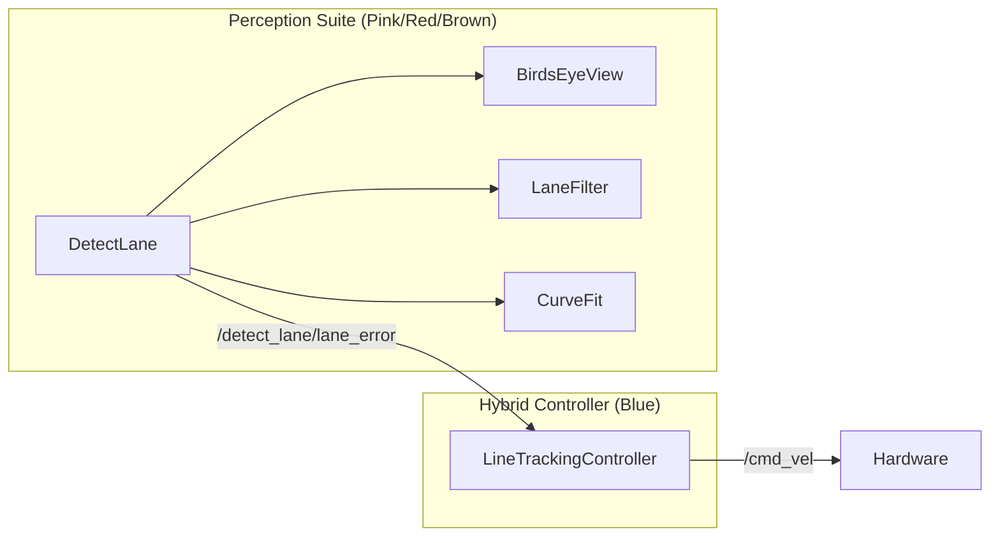

# Codebase Architecture Analysis: Dependency Graph

This document provides a detailed breakdown of the project's structural architecture based on the generated dependency graph. It explains the relationships between the ROS2 nodes, vision utilities, and control logic.

---

## 1. System Overview Graph

The project is divided into three primary functional zones, visualized as clusters in the graph:

1.  **Integrated Controller (Blue)**: The unified command center.
2.  **Modular Vision Pipeline (Pink/Red/Yellow)**: The perception suite.
3.  **Legacy/Standalone Control (Green)**: Alternative control implementation.
4.  **ROS2 Infrastructure (Teal)**: The framework foundation.

---

## 2. Cluster Breakdown

### A. The "Brain": LineTrackingController (Blue Cluster)
This cluster represents the main node `line_tracking.py`. It is the most densely connected area of the graph because it manages both sensing and acting.

- **Primary Node**: `LineTrackingController`
- **Critical Methods**:
    - `_loop()`: The 20Hz heartbeat driving all state transitions.
    - `_vel()`: The unified motor output gateway.
    - `_scan_cb()`: The LiDAR integration point.
- **Relationship**: It stands alone as a self-contained "Hybrid" unit (Line Tracking + Obstacle Avoidance).

### B. The "Perception Suite": Vision Pipeline (Mixed Clusters)
This area represents the modular approach to lane detection found in `detect_lane.py`.

- **Coordinator (Pink)**: `DetectLane` node. It doesn't do much math itself but calls upon helpers.
- **Perspective Engine (Yellow)**: `BirdsEyeView`. Transforms the camera's angled view into a "top-down" map.
- **Filter Engine (Red)**: `LaneFilter`. Isolates yellow pixels and cleans up noise.
- **Mathematics Engine (Brown)**: `CurveFit`. Uses the sliding window algorithm to fit a polynomial to the detected lane.

### C. The "Foundation": ROS2 Node Base (Teal Node)
The teal node labeled `Node` is the most significant structural anchor.
- **Inheritance**: Every executable module (`LineTrackingController`, `DetectLane`, `ControlRobot`) has an arrow pointing here.
- **Verdict**: This confirms the project follows strict object-oriented ROS2 standards, allowing for proper resource management and life-cycle handling.

---

## 3. Communication Flow

---

## 4. Credibility & Structural Integrity

- **High Cohesion**: Each cluster (especially the Vision Pipeline) focuses on a specific task, which is a sign of good software design.
- **Clear Separation of Concerns**: The graph shows that vision math (CurveFit) is decoupled from the actual robot movement (LineTrackingController).
- **Extensibility**: Because all modules point to the teal `Node`, adding a new sensor or controller is as simple as creating a new cluster and hooking it into the same base.

---
*Analysis generated by Antigravity AI*
