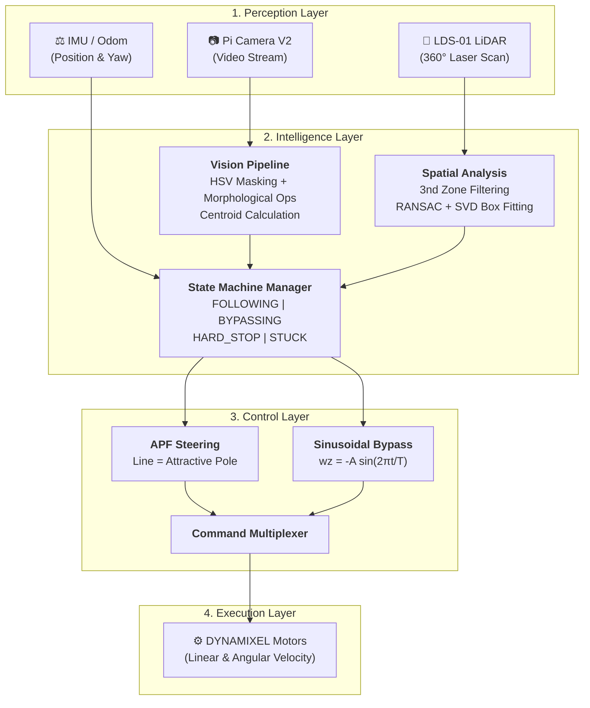

# Autonomous Line Tracking & Obstacle Avoidance: Detailed System Architecture

This document provides a comprehensive, from-scratch explanation of the **Autonomous Line Tracking** project. It covers the hardware, software, vision pipeline, and the mathematical implementation of the control system.

---

## 1. Project Overview

The objective of this project is to enable a **TurtleBot3 Waffle Pi** to autonomously navigate a path marked by a yellow line while gracefully avoiding box-shaped obstacles using LiDAR.

### Key Capabilities:

- **Smooth Line Following**: Uses a proportional control system inspired by Artificial Potential Fields (APF).
- **Geometric Perception**: Uses LiDAR data with RANSAC and SVD to measure obstacle dimensions.
- **Continuous Avoidance**: Implements a sinusoidal state machine to ensure fluid, non-jerky bypass maneuvers.
- **Fail-Safe Operation**: Features a 3-zone safety system to prevent collisions.

---

## 2. System Architecture



---

## 3. Detailed Control System: From Scratch

### Phase A: Line Following (APF Steering)

The robot treats the yellow line as an **attractive magnetic pole**. The steering logic is derived from identifying the "error" (how far the line is from the camera center) and converting it into a rotation.

**1. Vision Logic:**

- **HSV Conversion**: The BGR image is converted to HSV (Hue, Saturation, Value) to isolate the yellow tape regardless of lighting.
- **Centroid Calculation**: We compute the center of mass (`C_x`) of the yellow pixels using image moments.
- **Error Function**:

```text
error = Centroid_x - (Image_Width / 2)
```

**2. Steering Control (Proportional):**  
Instead of a simple "Turn Left/Right," we use a gain (`k_att`) to steer proportionally:

```text
steering_wz = -k_att * error
```

This creates a smooth "pull" toward the line, effectively acting as an **Artificial Potential Field**.

---

### Phase B: Obstacle Perception (Geometry & SVD)

When an obstacle enters the LiDAR's range, the robot doesn't just "see" a point; it analyzes the **geometry** using two advanced math techniques:

1. **RANSAC (Random Sample Consensus)**:
  - LiDAR scans often contain noise or curved edges. RANSAC fits a straight line to the points and discards "outliers" (noise), leaving only the flat face of the box.
2. **SVD (Singular Value Decomposition)**:
  - We calculate the "principal components" of the remaining points.
  - The first principal component represents the **width ($W$)** of the box.
  - The second principal component defines the **distance ($D$)** and **angle** of the face.

---

Traditional robots use "Stop, Turn 90°, Drive, Turn 90°". This is slow and jerky. Our system uses a **Sinusoidal Velocity Profile**.

**1. Heading Clearance Calculation:**  
Based on the measured width (`W`) and distance (`D`), we calculate the required clearing angle (`theta`):

```text
theta = arctan( (W/2 + Safety_Margin) / Distance )
```

**2. The Sinusoidal Command:**  
To move the robot in a smooth "S" curve that clears the obstacle and returns to the line, we use:

```text
wz(t) = -Amplitude * sin( (2 * pi * t) / Period )
```

- **A (Amplitude)**: Calculated as `(theta * pi) / Period` to ensure the total heading change matches our calculated `theta`.
- **T (Period)**: The total time the robot spends bypassing (standard 6-12 seconds).
- **Result**: Smooth acceleration profile preventing wheel slip and unstable camera feed.

---

## 4. The 3-Zone Safety System

The LiDAR constantly monitors a "front cone" to determine the robot's state:


| Zone                     | Distance Threshold | System Action                                                                 |
| ------------------------ | ------------------ | ----------------------------------------------------------------------------- |
| **Zone 1: Awareness**    | `1.00m`            | Log detection. Trigger RANSAC/SVD analysis to "look" at the obstacle size.    |
| **Zone 2: Start Bypass** | `0.75m`            | Transition from `FOLLOWING_LINE` to `BYPASSING`. Lock the sinusoidal profile. |
| **Zone 3: Hard Stop**    | `0.30m`            | Emergency zeroing of all velocities. Wait for path to clear.                  |


---

## 5. State Machine & Recovery

The robot operates as a Finite State Machine (FSM):

1. **FOLLOWING_LINE**: Default state. High-speed line tracking.
2. **BYPASSING**: Executing the sinusoidal arc.
3. **RESCUE/RECOVERY**: If a large yellow blob is detected during or after a bypass, the robot "snaps" back to tracking mode instantly to ensure it doesn't miss the path.
4. **STUCK**: If bypass takes too long, the robot reverses and retries with a fresh LiDAR scan.

---

## 6. How to Run

1. **Launch the Controller**:
  ```bash
   ros2 run waffle_pi_lane_tracking line_tracking
  ```
2. **Parameters**: You can tune the behavior in real-time:
  - `k_att`: Adjusts how aggressively it follows the line.
  - `follow_speed`: Base speed for straightaways.
  - `bypass_time`: Duration of the avoidance curve.

---

*for the Autonomous Navigation Task.*