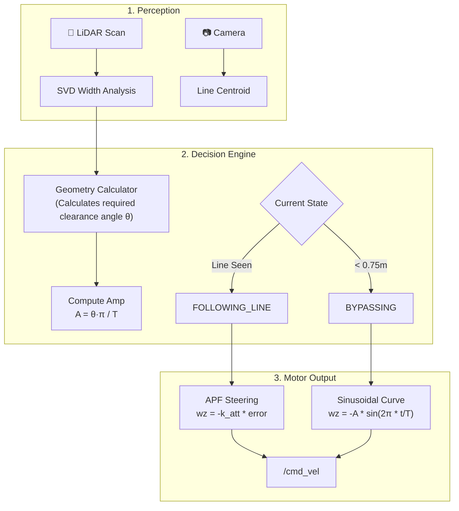

# Robot Control System: Hybrid APF + Sinusoidal State Machine

This document explains the current architecture of our robot's control system and why this specific hybrid approach was chosen over other available options.

## How the Control System Works

The robot's intelligence is built on a **Hybrid Control Architecture** that blends **Artificial Potential Fields (APF)** for precise tracking with a **Sinusoidal State Machine** for smooth obstacle avoidance.

### 1. Following the Line (APF Steering)
While in the `FOLLOWING_LINE` state, the robot treats the yellow line as an **attractive magnetic pole**. 
- **Input**: Camera centroid error (pixels from center).
- **Control**: Proportional steering gain (`k_att`).
- **Result**: Smooth, fluid adjustments that keep the robot centered on the line without the "hunting" behavior of simple on/off controllers.

### 2. The 3-Zone Detection System
The LiDAR constantly monitors a "front cone" to categorize obstacles by distance:
| Zone | Distance | Action |
| :--- | :--- | :--- |
| **Zone 1: Awareness** | 1.00m | Start RANSAC/SVD analysis to measure obstacle width. |
| **Zone 2: Start Bypass** | 0.75m | Transition to `BYPASSING` state. |
| **Zone 3: Hard Stop** | 0.30m | Immediate velocity zeroing to prevent collision. |

### 3. Sinusoidal Bypass Logic
Instead of jerky 90-degree turns, the robot follows a **continuous sinusoidal velocity profile**. 

---

## Why This System? (Comparison with Alternatives)

We chose the **Hybrid Sinusoidal** approach over simpler "Stop-and-Spin" or "Pure APF" methods for three main reasons:

### 1. Fluidity vs. Discontinuity (vs. Discrete State Machines)
Traditional state machines use "jumps" (e.g., set `wz` to -0.5 immediately). This creates **velocity discontinuities** that cause physical jerk, wheel slip, and unstable sensor data. Our sinusoidal profile follows a smooth curve (C1 continuity), ensuring the robot never experiences sudden acceleration spikes.

### 2. Geometry Awareness (vs. Fixed Arcs)
Unlike a fixed "turn-left-then-right" maneuver, our system uses **SVD (Singular Value Decomposition)** to measure the physical width of the box in real-time. It then calculates the exact clearing angle ($\theta$) required to bypass that specific obstacle size, making it far more robust than hard-coded timers.

### 3. Reliability of Intent (vs. Pure APF)
Pure Artificial Potential Fields can suffer from "local minima" where attractive and repulsive forces cancel out, causing the robot to get stuck. By wrapping the avoidance logic in a **State Machine**, we guarantee the robot completes the bypass maneuver before looking for the line again, while still benefiting from smooth APF tracking during normal operation.

### Comparison Summary

| Feature | Standard State Machine | Pure APF | **Our Hybrid Approach** |
| :--- | :--- | :--- | :--- |
| **Movement** | Jerky / Discontinuous | Very Smooth | **Fluid / Continuous** |
| **Line Tracking** | Oscillatory | Excellent | **Excellent (APF-based)** |
| **Obstacle Bypass** | Hardcoded / Rigid | Can get stuck | **Dynamic / Geometry-Aware** |
| **Reliability** | High | Low (Local Minima) | **Highest** |
