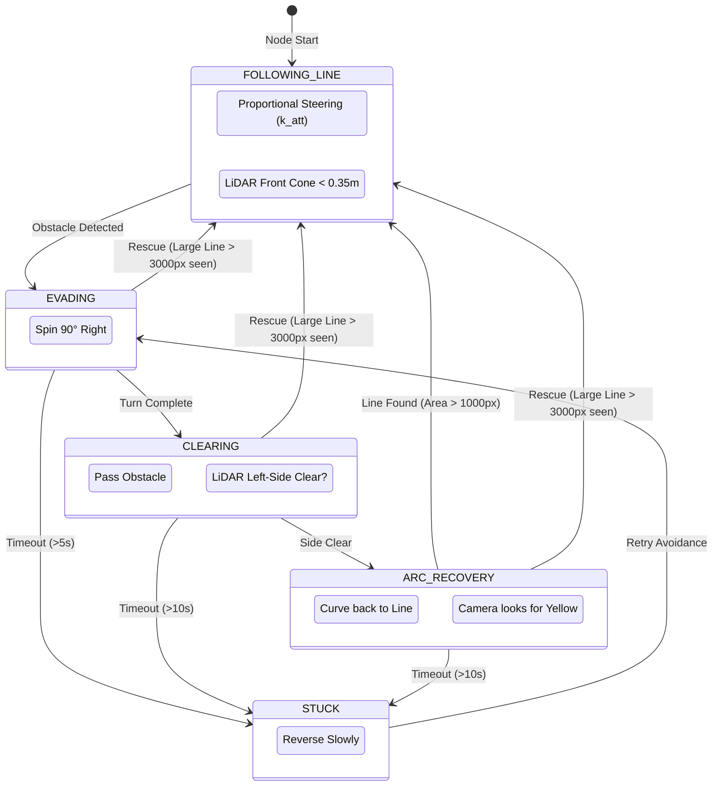

# Obstacle Detection and Avoidance Logic

This document outlines the state machine and sensor processing logic used for autonomous navigation in the `waffle_pi_lane_tracking` package.

## Control Architecture

The robot operates on a **20Hz control loop** (every 50ms). It never truly stops moving; even when "lost," it creeps at a minimum speed to ensure it can eventually re-acquire its path.

### State Machine Diagram

## Critical Decision Points

### 1. The Trigger (Detection)
*   **LiDAR Scan**: The robot processes the raw `/scan` topic.
*   **Front Cone**: It monitors a range of ±15° directly ahead (indices 0-15 and 345-360).
*   **Threshold**: If any valid point in this cone is `< 0.35m`, the `FOLLOWING_LINE` state is interrupted.

### 2. The "Rescue" Mechanism
*   **Manual Interference**: If a user picks up the robot and places it on the line during an obstacle bypass, the robot shouldn't keep avoiding a non-existent obstacle.
*   **Visual Override**: If `line_area > 3000 pixels` is detected while in `EVADING`, `CLEARING`, or `ARC_RECOVERY`, the robot instantly snaps back to `FOLLOWING_LINE`.

### 3. Recovery Search
*   **Memory**: The robot remembers the `last_error` (whether the line was to the left or right) before it was lost.
*   **Directional Rotation**: When the line is lost, it rotates in the direction of the last known error to "find" the line again quickly.

## Movement Lifecycle

*   **Continuous Motion**: Velocity commands (`_vel`) are published at 20Hz.
*   **Search Speed**: If no line is found, the robot creeps at `min_speed` (0.04m/s) while rotating.
*   **Adaptive Speed**: During line following, the robot slows down automatically on sharp turns proportional to the steering effort.
