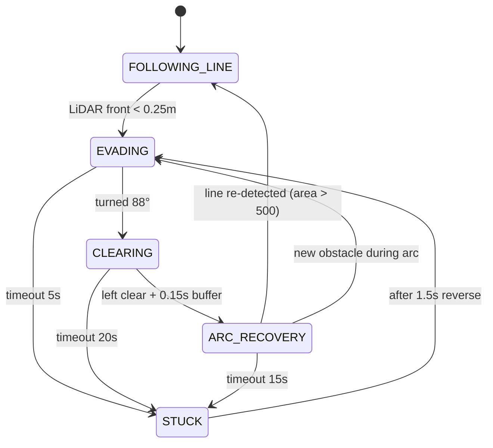

# Walkthrough: Antigravity Controller Integration

## What Was Done

Added a **4-state LiDAR obstacle-bypass line-following node** to the existing `waffle_pi_lane_tracking` package — zero changes to existing files.

## Files Changed

| Action | File | Change |
|---|---|---|
| **NEW** | [antigravity_controller.py](file:///home/aashish/Desktop/ROS2_workspace/waffle_pi_lane_tracking/waffle_pi_lane_tracking/antigravity_controller.py) | 413-line node with full state machine |
| **NEW** | [antigravity.launch.py](file:///home/aashish/Desktop/ROS2_workspace/waffle_pi_lane_tracking/launch/antigravity.launch.py) | Dedicated launch file |
| **+1 line** | [package.xml](file:///home/aashish/Desktop/ROS2_workspace/waffle_pi_lane_tracking/package.xml) | Added `nav_msgs` depend |
| **+1 line** | [setup.py](file:///home/aashish/Desktop/ROS2_workspace/waffle_pi_lane_tracking/setup.py) | Registered entry point |

## State Machine



## Onboard Pi 4 Optimizations

- Image resized to **320×240** with `INTER_NEAREST` (fastest interpolation)
- **Adaptive threshold** (no color conversion overhead beyond grayscale)
- Camera callbacks **skipped entirely** during States 1, 2, STUCK (CPU freed for LiDAR)
- Uses `CompressedImage` (matches existing `camera_ros` node output)

## How to Build & Run (on Raspberry Pi)

```bash
# Terminal 1: Bringup (already running)
ros2 launch turtlebot3_bringup robot.launch.py

# Terminal 2: Camera (already running)
ros2 run camera_ros camera_node --ros-args -p width:=640 -p height:=480 -p pixel_format:=RGB888

# Terminal 3: Build & launch antigravity controller
cd ~/Desktop/ROS2_workspace
colcon build --packages-select waffle_pi_lane_tracking
source install/setup.bash
ros2 launch waffle_pi_lane_tracking antigravity.launch.py
```

## Verify Topics

```bash
ros2 node list    # → /antigravity_controller
ros2 topic list   # → /cmd_vel, /scan, /odom, /image_raw/compressed
```

## Existing Pipeline Unaffected

The old two-node pipeline still works independently:
```bash
ros2 launch waffle_pi_lane_tracking lane_tracking.launch.py
```

> [!CAUTION]
> Do not run both launch files simultaneously — they both publish to `/cmd_vel`.
