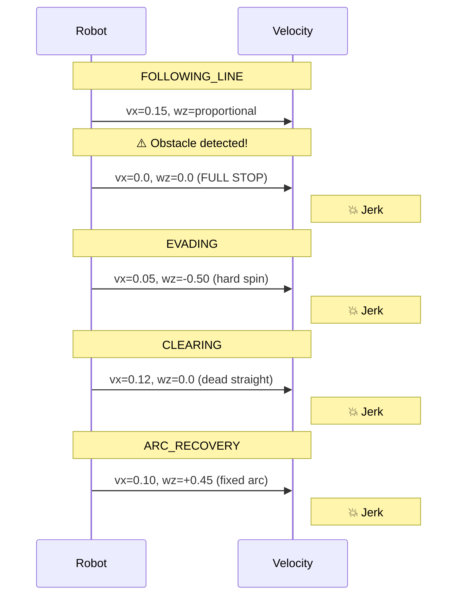
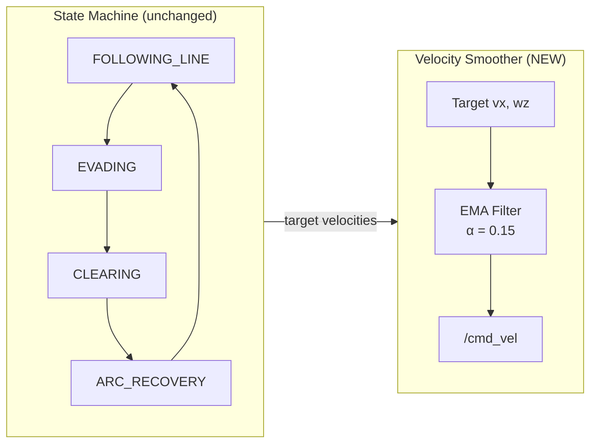
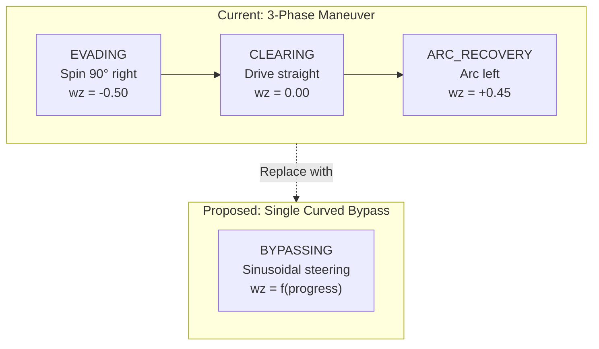
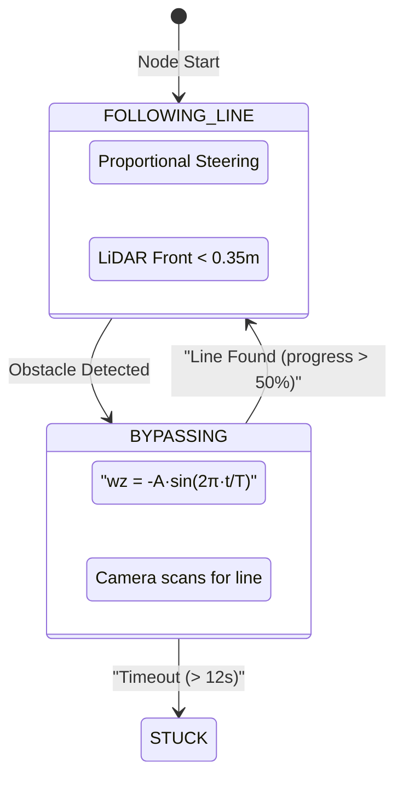
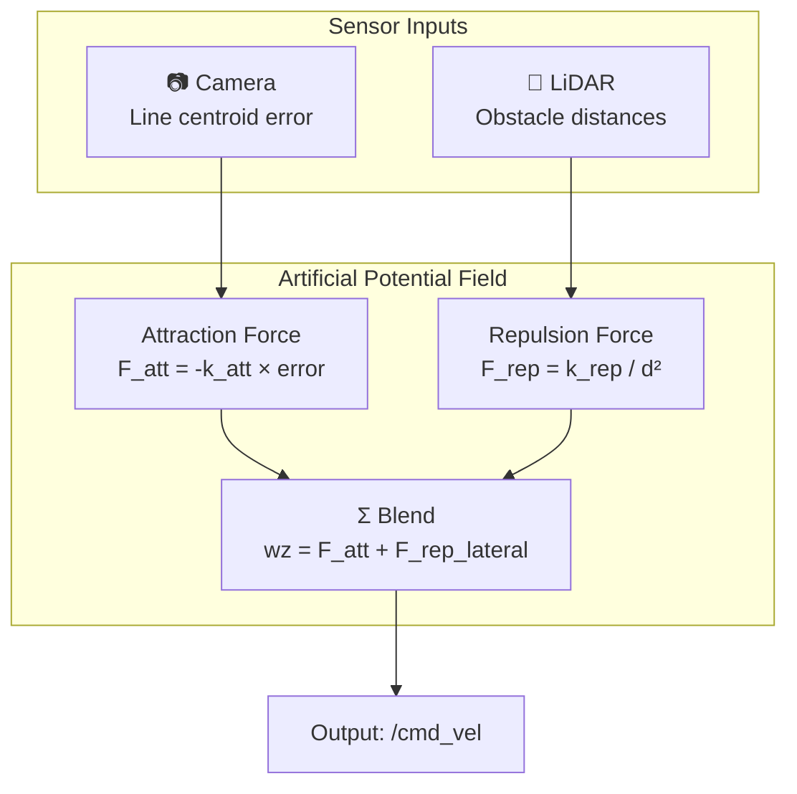
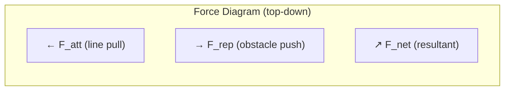

# Smooth Obstacle Avoidance — Upgrade Options

This document explores methods to eliminate jerky movements during obstacle avoidance by transitioning from discrete state jumps to continuous velocity control.

## Problem: Why the Current Approach Is Jerky

The current state machine creates **three hard velocity discontinuities** during every obstacle bypass:



Each state transition is an **instantaneous velocity jump** — the wheels go from one speed to a completely different one in a single 50ms tick. This causes physical jerking, wheel slip, and unstable sensor readings.

---

## Option A: Velocity Ramping (Easiest)

**Keep the existing state machine, but smooth velocity transitions using exponential moving average (EMA).**

### How It Works



### Code Changes Sketch

Add a velocity smoother that sits between the state machine output and the `/cmd_vel` publisher:

```python
# New instance variables in __init__:
self.smooth_vx = 0.0
self.smooth_wz = 0.0
self.alpha     = 0.15   # smoothing factor (lower = smoother, 0.10–0.20 recommended)

# Replace the _vel() method:
def _vel(self, vx=0.0, wz=0.0):
    """Publish smoothed velocity — ramps toward target instead of jumping."""
    self.smooth_vx += self.alpha * (vx - self.smooth_vx)
    self.smooth_wz += self.alpha * (wz - self.smooth_wz)
    msg = Twist()
    msg.linear.x  = float(self.smooth_vx)
    msg.angular.z = float(self.smooth_wz)
    self.cmd_pub.publish(msg)
```

### Pros & Cons

| Aspect | Rating |
|--------|--------|
| Implementation effort | ⭐ Very easy (~10 lines changed) |
| Smoothness | ⭐⭐ Good — removes velocity jumps |
| Risk of breaking existing logic | Very low |

---

## Option B: Curved Bypass Path (Moderate)

**Replace the spin-straight-arc maneuver with a single continuous D-shaped curve.**

### How It Works



The angular velocity follows a **sinusoidal profile** instead of discrete steps:

```python
# Sinusoidal steering: curves right → straightens → curves left
# progress 0.0–1.0
wz = -max_turn * math.sin(progress * 2.0 * math.pi - math.pi / 3.0)
```

### State Diagram (Simplified)



---

## Option C: Full APF Blending (Best Smoothness)

**Extend the existing APF line-attraction to include LiDAR-based obstacle repulsion.**

### How It Works



### Force Diagram



### Pros & Cons

| Aspect | Rating |
|--------|--------|
| Smoothness | ⭐⭐⭐⭐ Best — completely continuous |
| Implementation effort | ⭐⭐⭐ Significant (~100+ lines) |
| Risk | Higher — fundamentally different approach |

---

## Comparison Summary

| Feature | Option A: Ramping | Option B: Curved Bypass | Option C: Full APF |
|---------|-------------------|-------------------------|--------------------|
| **Difficulty** | Easy | Moderate | Hard |
| **Smoothness** | Good | Excellent | Best |
| **Keeps SM?** | ✅ Yes | Partially | ❌ No |
| **Recommended** | Quick win | Balanced | Research/Pro |
